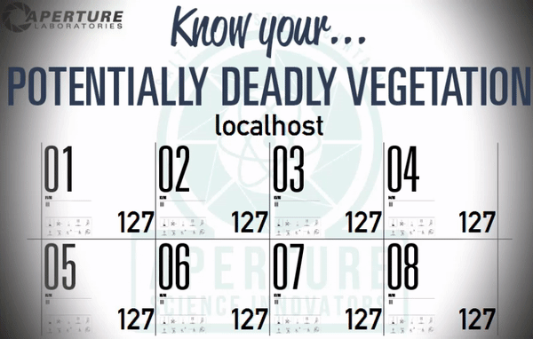

# Sierra

  

## What's this?

A client-server TCP school project, the assignment was to create a server which controlled the temperatures of a virtual greenhouse. I decided to keep this because I had put a lot of effort into creating Portal themed graphics.\
And for a good while, this was my only TCP example.

The graphics were made in Illustrator and After Effects, after a fair amount of internet digging. I guess I was really into Portal in that period. I think I still am :).

The project uses both TCP and UDP: the clients set the temperature through TCP, the server broadcasts periodically on `255.255.255.255` the current temperatures through UDP. Values go from 0 to 255, for example puproses.

*Look at those flashes*

  

## Features

* TCP and themed graphics, not much else

## Curator

* eclipse workspace
* seems to be unable to bind ports if ran in newer JVMs. It was developed in Java 1.8
